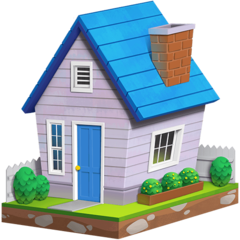

# Home Server

<p align="center">
  
</p>

## Setup

1. Add any .env or .key files needed
1. Open a terminal window, run `yarn prod-serve`

### To run the internet status service

Make sure docker is running, then run:

```sh
docker run \
    -d \
    --restart=always -p 3001:3001 \
    -v uptime-kuma:/app/data \
    --name uptime-kuma \
    louislam/uptime-kuma:1
```

That will make `http://localhost:3001/status/chove` live

## Development

1. Add any .env or .key files needed
1. Open a terminal window, run `yarn start`
1. On a new terminal window, run `yarn dev-serve`
